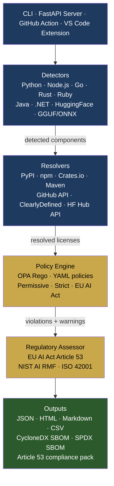
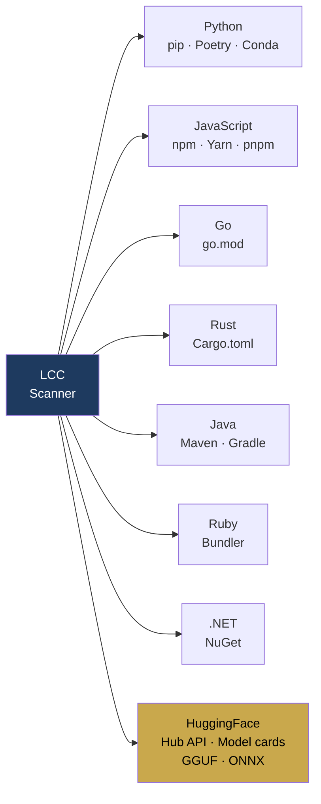
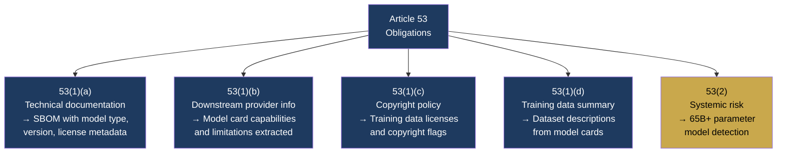
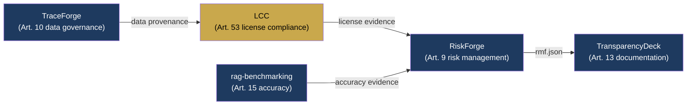

# License Compliance Checker (LCC)

[](https://pypi.org/project/license-compliance-checker/)
[](https://github.com/aiexponenthq/license-compliance-checker/actions)
[](LICENSE)
[](https://www.python.org/downloads/)
[](https://eur-lex.europa.eu/legal-content/EN/TXT/?uri=CELEX:32024R1689)

**Know what you ship. Know what you owe.**

The only open-source scanner that combines dependency license detection, AI model license analysis, and EU AI Act Article 53 compliance — in a single tool.

Built by [AiExponent LLC](https://aiexponent.com). Apache 2.0. Free alternative to FOSSA ($50K+/yr) and Black Duck ($30K+/yr).

---

## Quick Start

```bash
pip install license-compliance-checker

# Scan a project
lcc scan .

# Scan with EU AI Act compliance policy
lcc scan . --policy eu-ai-act-compliance --format json

# Generate a CycloneDX SBOM
lcc sbom generate --input scan-report.json --format cyclonedx --output sbom.json

# Check GPL contamination in a SaaS context
lcc scan . --project-license Apache-2.0 --context saas
```

---

## Why LCC

| | LCC | FOSSA | Black Duck |
|---|---|---|---|
| AI model license detection | ✅ | ❌ | ❌ |
| EU AI Act Article 53 output | ✅ | ❌ | ❌ |
| HuggingFace Hub API resolver | ✅ | ❌ | ❌ |
| GGUF / ONNX model scanning | ✅ | ❌ | ❌ |
| Training data risk registry | ✅ | ❌ | ❌ |
| SBOM (CycloneDX + SPDX) | ✅ | ✅ | ✅ |
| Policy-as-code (OPA / YAML) | ✅ | ✅ | ✅ |
| Price | **Free** | $50K+/yr | $30K+/yr |

---

## Architecture



---

## Ecosystem Coverage



---

## EU AI Act Article 53 Coverage

August 2025 — GPAI obligations are **already enforced**. Providers of general-purpose AI models must publish technical documentation. LCC automates evidence gathering for each sub-obligation:



> **Scope note:** LCC generates audit evidence for Article 53 documentation obligations. It is not a legal compliance determination. Involve qualified legal counsel for final compliance assessment.

---

## AI Model Detection

LCC scans your codebase for AI model references without requiring a local download:

```bash
# Detects from_pretrained("org/model") references in Python / YAML / JSON
lcc scan .

# Detects GGUF and ONNX model files (Ollama / llama.cpp)
lcc scan /path/to/models

# Full transitive scan with lock file
lcc scan . --include-transitive --policy permissive
```

**Supported AI license formats:** RAIL, OpenRAIL, Llama 2/3/3.1, Gemma, Mistral, Mixtral, BigScience, Falcon, Grok, DeepSeek, and 20+ more.

**Training data risk registry:** Flags datasets with commercial use risk — OpenAI API outputs, ShareGPT, Books3, The Pile classified as high/critical risk.

---

## Policy Enforcement

```bash
# Built-in policies
lcc scan . --policy permissive            # Allow MIT, Apache-2.0, BSD only
lcc scan . --policy strict                # Block all copyleft
lcc scan . --policy eu-ai-act-compliance  # Article 53 GPAI obligations

# Custom policy (YAML)
cat > my-policy.yaml << EOF
name: my-saas-policy
rules:
  - license: GPL-3.0
    action: block
    reason: "GPL-3.0 requires SaaS source disclosure"
  - license: AGPL-3.0
    action: block
  - license: RAIL
    action: warn
    reason: "Review RAIL restrictions before deploying"
EOF

lcc scan . --policy my-policy.yaml
```

---

## CI/CD Integration

```yaml
# .github/workflows/license-check.yml
- name: License compliance scan
  uses: aiexponenthq/license-compliance-checker/.github/actions/license-compliance@v1
  with:
    path: .
    policy: eu-ai-act-compliance
    fail-on: violations
    format: sarif
    output: license-scan.sarif
```

---

## SBOM Generation

```bash
# CycloneDX 1.4 with EU AI Act regulatory extensions
lcc sbom generate --input scan-report.json --format cyclonedx --output sbom.cdx.json

# SPDX 2.3
lcc sbom generate --input scan-report.json --format spdx --output sbom.spdx.json

# Sign with GPG for tamper-evidence
lcc sbom sign --input sbom.cdx.json --key ~/.gnupg/key.gpg
```

---

## AiExponent Toolchain



---

## Known Limitations

- HuggingFace Hub API scanning requires referenced model IDs (not local downloads only).
- SPDX `AND`/`OR` compound expressions are flagged for manual review, not auto-resolved.
- Transitive dependency resolution requires a lock file (`poetry.lock`, `package-lock.json`).
- Article 53 assessment covers documentation completeness only — not a legal compliance determination.
- Training data risk registry covers top-50 known datasets; unknown datasets flagged for review.

---

## Contributing

See [CONTRIBUTING.md](CONTRIBUTING.md). Issues and PRs welcome.

```bash
git clone https://github.com/aiexponenthq/license-compliance-checker
cd license-compliance-checker
pip install -e ".[dev]"
pytest
```

---

## License

[Apache 2.0](LICENSE) — free to use, modify, and distribute.

Built by [AiExponent LLC](https://aiexponent.com) — `hello@aiexponent.com`

---

*Part of the AiExponent open-source AI governance toolchain:
**license-compliance-checker** ·
[rag-benchmarking](https://github.com/aiexponenthq/rag-benchmarking) ·
[RiskForge](https://github.com/aiexponenthq/riskforge)*
