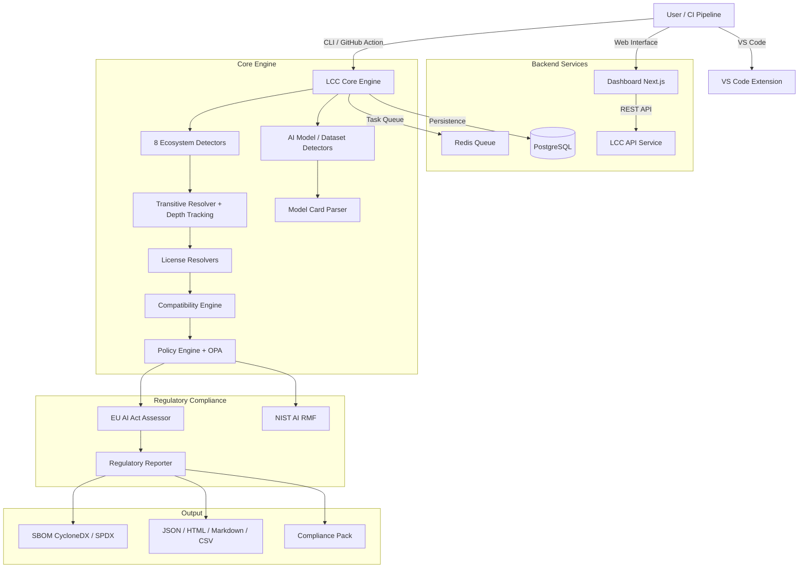

# License Compliance Checker (LCC)

[](LICENSE)
[](pyproject.toml)
[](https://github.com/apundhir/license-compliance-checker/actions/workflows/ci.yml)
[](https://pypi.org/project/license-compliance-checker/)
[](https://marketplace.visualstudio.com/items?itemName=lcc.license-compliance-checker)
[](CONTRIBUTING.md)

**Know what you ship. Know what you owe.**

AI-native license compliance for the regulatory era. LCC is the only open-source scanner that combines dependency license detection, AI model license analysis, and EU AI Act Article 53 compliance -- in a single tool.

---

## Why LCC?

- **The only open-source scanner with AI model license detection + EU AI Act compliance.** Detects HuggingFace model licenses, RAIL restrictions, training data provenance, and maps findings to Article 53 obligations automatically.
- **Free alternative to FOSSA ($50K+/yr) and Black Duck ($30K+/yr).** Full transitive dependency resolution across 8 ecosystems, SBOM generation, and policy-as-code -- with no per-seat fees.
- **Detects GPL contamination, AGPL in SaaS, and license conflicts automatically.** Plain-English explanations tell you exactly what is wrong and how to fix it, before legal does.

---

## Quick Start

### Install from PyPI

```bash
pip install license-compliance-checker

# Scan a project
lcc scan .

# Scan with EU AI Act compliance policy
lcc scan . --policy eu-ai-act-compliance

# Generate an SBOM
lcc sbom generate --input scan-report.json --format cyclonedx --output sbom.json

# Check license compatibility
lcc scan . --project-license Apache-2.0 --context saas
```

### Install with Docker

```bash
git clone https://github.com/apundhir/license-compliance-checker.git
cd license-compliance-checker

export LCC_SECRET_KEY=$(python -c "import secrets; print(secrets.token_hex(32))")
export POSTGRES_PASSWORD=$(python -c "import secrets; print(secrets.token_hex(16))")

docker-compose -f docker-compose.prod.yml up -d --build
# Dashboard: http://localhost:3000  |  API: http://localhost:8000
```

---

## Key Features

### AI Model & Dataset Scanning

LCC provides first-class support for AI/ML components that traditional SCA tools ignore entirely.

- **HuggingFace model card parsing** -- extracts training data sources, known limitations, evaluation metrics, environmental impact, and use restrictions from model cards and dataset cards.
- **RAIL restriction display in plain English** -- translates OpenRAIL, Llama, and other AI-specific license restrictions into clear, actionable language (e.g., "No harm", "User threshold applies", "Attribution required").
- **EU AI Act compliance assessment** -- automatically evaluates AI models against Article 53 GPAI obligations and assigns risk classifications (Minimal, Limited, High, GPAI, GPAI Systemic, Prohibited).

### License Compatibility Engine

Goes beyond detection to find conflicts across your entire dependency tree.

- **GPL contamination detection** -- flags strong copyleft licenses (GPL-2.0, GPL-3.0) in permissive-licensed projects with plain-English explanations.
- **AGPL-in-SaaS detection** -- identifies AGPL-3.0 dependencies that require full source disclosure in SaaS deployments.
- **Pairwise conflict analysis** -- detects known incompatible license combinations (e.g., GPL-2.0 + Apache-2.0, GPL + BSD-4-Clause).
- **Copyleft version conflicts** -- flags GPL-2.0-only vs GPL-3.0 combinations that prevent legal distribution.
- **Weak copyleft boundary warnings** -- advises on LGPL dynamic linking, MPL file-level copyleft, and EPL patent obligations.

### Transitive Dependency Resolution

Resolves the full dependency tree with depth tracking, not just direct dependencies.

- **8 ecosystems** -- Python (pip, Poetry, Conda), JavaScript (npm, Yarn, pnpm), Go, Java (Maven), Kotlin/Groovy (Gradle), Rust (Cargo), Ruby (Bundler), and .NET (NuGet).
- **Depth metadata** -- every component is tagged with its depth in the dependency tree (depth 0 = direct, depth 1+ = transitive).
- **Policy awareness** -- policies can distinguish between direct and transitive dependencies, allowing different rules for each.

### Policy-as-Code

Enforce compliance rules automatically using OPA or built-in policy templates.

- **Built-in regulatory templates** -- `eu-ai-act-compliance`, `nist-ai-rmf`, `permissive`, `strict`, and more.
- **OPA integration** -- write custom policies in Rego for fine-grained control.
- **Policy testing framework** -- validate policies before deploying them to CI.

### SBOM Generation

Produce audit-ready Software Bill of Materials with regulatory extensions.

- **CycloneDX and SPDX** -- industry-standard SBOM formats with full component metadata.
- **GPG signing and validation** -- sign SBOMs for tamper-evident compliance records.
- **Regulatory extensions** -- `lcc:regulatory:*` properties embed EU AI Act risk classification, copyright compliance status, and training data provenance directly in the SBOM.

### Web Dashboard

Explore scan results, manage policies, and track compliance visually.

- **AI Model tab** -- dedicated view for AI models with RAIL restriction panels, license details, and training data summaries.
- **EU AI Act compliance page** -- per-component obligation status, risk badges, and compliance pack export.
- **Dependency depth view** -- depth badges, transitive dependency filtering, and parent component tooltips.

### VS Code Extension

Shift-left compliance -- catch violations before you commit.

- **Scan on save** -- automatically scans manifest files with a 300 ms debounce.
- **Inline diagnostics** -- violations appear as red underlines, warnings as yellow, directly in your editor.
- **Status bar indicator** -- shield icon shows violation count (red) or "Compliant" (green).
- **Commands** -- `LCC: Scan Workspace` and `LCC: Scan Current File` from the Command Palette.
- **Multi-root workspace support** -- scans every root when triggered.

### CI/CD Integration

Block non-compliant code from merging with the LCC GitHub Action.

- **fail-on** -- fail the build on `violations`, `warnings`, or `none`.
- **ecosystems** -- scope scans to specific languages (e.g., `python,node,go`).
- **sbom-format** -- generate CycloneDX or SPDX SBOMs as build artifacts.
- **Policy enforcement** -- apply any built-in or custom policy in CI.

---

## EU AI Act Compliance

LCC is the first open-source tool to automate EU AI Act Article 53 compliance for General Purpose AI (GPAI) models. This is the single biggest regulatory change affecting AI deployments in the EU, and most organisations are not prepared.

### What Article 53 Requires

Providers of GPAI models must comply with five obligations:

| Obligation | Article | What LCC Does |
|---|---|---|
| Technical documentation | Art.53(1)(a) | Generates SBOM with model type, version, license, and metadata |
| Information for downstream providers | Art.53(1)(b) | Extracts model card descriptions, capabilities, and limitations |
| Copyright policy | Art.53(1)(c) | Identifies training data licenses, flags unverified copyright |
| Training data summary | Art.53(1)(d) | Extracts datasets, data sources, and descriptions from model cards |
| Systemic risk obligations | Art.53(2) | Detects large models (65B+ params), checks eval metrics and safety docs |

### Compliance Pack Export

Generate a complete compliance bundle for auditors with a single command:

```bash
lcc scan /path/to/project --policy eu-ai-act-compliance
```

The compliance pack includes:
- `eu_ai_act_report.json` -- structured regulatory assessment with per-obligation status
- `eu_ai_act_report.html` -- branded HTML report with executive summary and component cards
- `training_data_summary.json` -- extracted training data information for all AI models
- `copyright_policy_template.md` -- pre-populated copyright policy template for Art.53(1)(c)

### Regulatory Policy Templates

Apply built-in regulatory policies that map directly to framework requirements:

```bash
# EU AI Act compliance
lcc scan . --policy eu-ai-act-compliance

# NIST AI Risk Management Framework
lcc scan . --policy nist-ai-rmf
```

---

## Competitive Comparison

| Feature | LCC v2.0 | FOSSA | Black Duck | Snyk | ORT |
|---|:---:|:---:|:---:|:---:|:---:|
| AI model license detection | Yes | No | No | No | No |
| EU AI Act compliance | Yes | No | No | No | No |
| RAIL restriction parsing | Yes | No | No | No | No |
| License compatibility engine | Yes | Yes | Yes | Partial | Yes |
| Transitive dependency resolution | Yes (8 ecosystems) | Yes | Yes | Yes | Yes |
| SBOM generation (CycloneDX + SPDX) | Yes | Yes | Yes | Partial | Yes |
| Policy-as-code (OPA) | Yes | Partial | No | No | Yes |
| VS Code extension | Yes | No | No | Yes | No |
| GitHub Action | Yes | Yes | Yes | Yes | Yes |
| Open source | Yes (Apache-2.0) | No | No | No | Yes |
| Price | Free | $50K+/yr | $30K+/yr | $25K+/yr | Free |

---

## Supported Ecosystems

| Ecosystem | Manifest Files | Lock Files | Transitive Resolution |
|---|---|---|:---:|
| **Python** | `requirements.txt`, `pyproject.toml`, `setup.py`, `Pipfile`, `environment.yml` | `poetry.lock`, `Pipfile.lock` | Yes |
| **JavaScript** | `package.json` | `package-lock.json`, `yarn.lock`, `pnpm-lock.yaml` | Yes |
| **Go** | `go.mod` | `go.sum`, vendor trees | Yes |
| **Java** | `pom.xml` (Maven) | -- | Yes |
| **Kotlin/Groovy** | `build.gradle`, `build.gradle.kts` | -- | Yes |
| **Rust** | `Cargo.toml` | `Cargo.lock` | Yes |
| **Ruby** | `Gemfile` | `Gemfile.lock` | Yes |
| **.NET** | `*.csproj`, `packages.config`, `*.nuspec` | -- | Yes |
| **HuggingFace** | Model cards, dataset cards | -- | -- |

---

## CLI Reference

```bash
# Basic scan
lcc scan /path/to/project

# Scan with policy enforcement
lcc scan . --policy strict
lcc scan . --policy eu-ai-act-compliance

# Scan with license compatibility checking
lcc scan . --project-license Apache-2.0 --context saas

# Generate reports
lcc report --input scan-report.json --format html --output report.html
lcc report --input scan-report.json --format markdown --output report.md

# SBOM generation and signing
lcc sbom generate --input scan-report.json --format cyclonedx --output sbom.json
lcc sbom sign --input sbom.json --key private.gpg --output sbom.json.sig

# Policy management
lcc policy list
lcc policy show eu-ai-act-compliance
lcc policy test my-policy.rego

# Background job queue
lcc queue submit /path/to/project --policy strict
lcc queue status <job-id>
lcc queue worker
```

---

## GitHub Action

Add license compliance checks to any GitHub workflow:

```yaml
name: License Compliance
on: [push, pull_request]

jobs:
  compliance:
    runs-on: ubuntu-latest
    steps:
      - uses: actions/checkout@v4

      - uses: actions/setup-python@v5
        with:
          python-version: '3.11'

      - uses: apundhir/license-compliance-checker/.github/actions/license-compliance@v1
        with:
          path: '.'
          policy: 'strict'
          fail-on: 'violations'
          ecosystems: 'python,node,go'
          sbom-format: 'cyclonedx'
          format: 'json'
          output: 'lcc-report.json'

      - uses: actions/upload-artifact@v4
        if: always()
        with:
          name: compliance-report
          path: lcc-report.json
```

### Action Inputs

| Input | Default | Description |
|---|---|---|
| `path` | `.` | Project path to scan |
| `policy` | -- | Policy name to apply |
| `fail-on` | `violations` | When to fail: `violations`, `warnings`, `none` |
| `ecosystems` | `all` | Comma-separated ecosystems to scan |
| `sbom-format` | `none` | SBOM output format: `cyclonedx`, `spdx`, `none` |
| `format` | `json` | Report format: `json`, `markdown`, `html`, `csv` |
| `exclude` | -- | Glob patterns to exclude, comma-separated |

---

## VS Code Extension

Install the **License Compliance Checker** extension from the VS Code Marketplace, or search for `lcc` in the Extensions panel. Requires the `lcc` CLI on your `PATH`.

Supported settings:

| Setting | Default | Description |
|---|---|---|
| `lcc.enabled` | `true` | Enable or disable the extension |
| `lcc.scanOnSave` | `true` | Scan manifest files on save |
| `lcc.lccPath` | `"lcc"` | Path to the CLI executable |
| `lcc.policy` | `""` | Policy to apply (e.g., `eu-ai-act-compliance`) |
| `lcc.threshold` | `0.5` | Confidence threshold for violations |

---

## Architecture



---

## Documentation

- [Documentation Site](https://apundhir.github.io/license-compliance-checker/) -- full guides, tutorials, and API reference
- [User Guide](docs/guides/user.md)
- [Policy Guide](docs/guides/policies.md)
- [Deployment Guide](docs/deployment/index.md)
- [API Reference](docs/reference/api.md)
- [AI Ethics & Privacy](docs/AI_ETHICS.md)
- [FAQ](docs/reference/faq.md)

---

## Benchmarks

LCC ships with a benchmark framework measuring detection accuracy, scan speed, and AI model license detection across a 50-project corpus spanning all 8 ecosystems. Performance targets: scan time under 10s for 50 dependencies, AI model detection at 95%+ accuracy. See [benchmarks/README.md](benchmarks/README.md) for methodology and results.

```bash
python -m benchmarks.run_benchmarks --all -v
```

---

## Development

```bash
# Create virtual environment
python -m venv venv
source venv/bin/activate

# Install with test dependencies
pip install -e ".[test]"

# Run tests
pytest

# Run the API server
LCC_SECRET_KEY=dev-key lcc server

# Run the dashboard
cd dashboard && npm install && npm run dev

# Build VS Code extension
cd vscode-extension && npm install && npm run compile
```

See [CONTRIBUTING.md](CONTRIBUTING.md) for development guidelines and [SECURITY.md](SECURITY.md) for reporting vulnerabilities.

---

## License

Apache License 2.0 -- see [LICENSE](LICENSE) for details.
