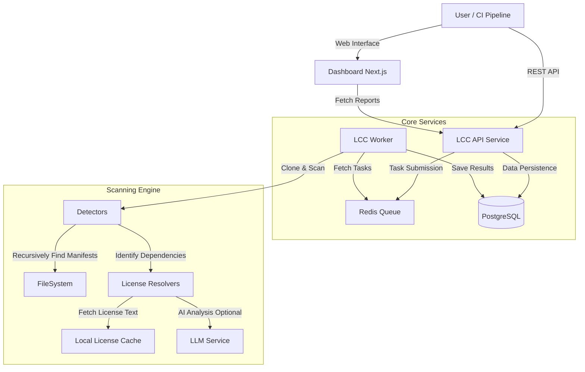

# License Compliance Checker (LCC)

[](LICENSE)
[](pyproject.toml)
[](https://github.com/psf/black)
[](CONTRIBUTING.md)

**Automated License Compliance for the AI Era.**

LCC is an enterprise-grade, open-source compliance platform designed to secure your software supply chain. It automates license detection, policy enforcement, and compliance reporting across complex polyglot repositories, with first-class support for AI/ML models and datasets.

## Why LCC?

In the age of AI and modular software, dependency chains are exploding. Manual compliance reviews effectively halt development velocity. LCC solves this by:
*   **Reducing Risk**: Instantly identifying GPL/AGPL contamination in proprietary codebases.
*   **Saving Time**: Automating "Bill of Materials" (SBOM) and attribution generation.
*   **AI-Native**: Interpreting complex AI model licenses (e.g., Llama 2, OpenRAIL) that traditional tools miss.

## Key Features

- **Multi-Language Support**: Recursively scans and detects dependencies for Python, JavaScript/TypeScript, Go, Maven, Gradle, and Rust/Cargo projects, including support for monorepos and nested structures.
- **Automated Policy Enforcement**:Define and enforce compliance policies (e.g., "Ban GPL-3.0 in proprietary projects") using OPA (Open Policy Agent) or built-in rules.
- **Modern Web Dashboard**: visually explore scan results, view attribution reports, and manage policies via a Next.js-based UI.
- **Asynchronous Processing**: high-performance, background job processing with Redis-backed queues for scanning large repositories without blocking.
- **Attribution Generation**: automatically generate compliant NOTICE files and attribution reports for distribution.
- **AI-Powered Analysis**:### AI-Powered License Analysis

LCC supports LLM-based license analysis to resolve ambiguous license texts or headers, integrated with **Fireworks AI**.

To enable AI analysis, configure the following environment variables:

```bash
export LCC_LLM_PROVIDER=fireworks
export LCC_FIREWORKS_API_KEY=your_fireworks_api_key
export LCC_LLM_MODEL=accounts/fireworks/models/llama-v3p1-70b-instruct
```

This enables the `ai_analysis` resolution strategy, which the scanner uses when standard regex matching returns low confidence or fails.

## System Architecture

LCC is built as a modular microservices architecture, ensuring scalability and separation of concerns.



## Use Cases

### 1. CI/CD Integration
Integrate LCC into your GitHub Actions or Jenkins pipelines to block pull requests that introduce restricted licenses (e.g., AGPL) before they merge.

### 2. Software Due Diligence
Run deep scans on acquired codebases to generate a Bill of Materials (SBOM) and identify potential legal risks or unapproved dependencies.

### 3. Release Compliance
Automatically generate a `NOTICE` file for your software releases, ensuring you meet attribution requirements for all bundled open-source components.

## Getting Started

### Prerequisites
- Docker & Docker Compose

### Quick Start (Production)

To run the complete stack (API, Worker, Dashboard, Database, Redis):

```bash
# Clone the repository
git clone https://github.com/apundhir/license-compliance-checker.git
cd license-compliance-checker

# Start the services
docker-compose -f docker-compose.prod.yml up -d --build
```

The services will be available at:
- **Dashboard**: http://localhost:3000
- **API**: http://localhost:8000
- **API Documentation**: http://localhost:8000/docs

### Configuration

Environment variables can be set in `.env` or `docker-compose.prod.yml`:

| Variable | Description | Default |
|----------|-------------|---------|
| `LCC_DATABASE_URL` | Checksum database connection string | `postgresql+asyncpg://user:pass@db/lcc` |
| `LCC_REDIS_URL` | Redis connection for job queue | `redis://:pass@redis:6379/0` |
| `NEXT_PUBLIC_API_URL` | Backend URL for the frontend | `http://localhost:8000` |
| `LCC_CACHE_DIR` | Directory for caching license texts | `/home/lcc/.lcc/cache` |

## Supported Detectors

LCC recursively scans your project directory to find manifest files in any subdirectory:

- **Python**: `requirements.txt`, `pyproject.toml`, `setup.py`, `Pipfile`, `poetry.lock`, `environment.yml`
- **JavaScript**: `package.json`, `package-lock.json`, `yarn.lock`, `pnpm-lock.yaml`, `node_modules` (optional)
- **Go**: `go.mod`, `go.sum`, vendor trees
- **Java/Kotlin**: `pom.xml` (Maven), `build.gradle`, `build.gradle.kts`
- **Rust**: `Cargo.toml`, `Cargo.lock`

## Documentation

- [User Guide](docs/guides/user.md)
- [API Reference](docs/reference/api.md)
- [Deployment Guide](docs/deployment/index.md)
- [Policy Guide](docs/guides/policies.md)

See the [docs/](docs/README.md) directory for more detailed guides and references.

## Development

Run the services locally for development:

```bash
# Install Python dependencies
pip install -e .[dev]

# Run API
lcc server

# Run Worker
lcc queue worker

# Run Frontend
cd dashboard && npm run dev
```

## License

This project is licensed under the Apache 2.0 License.
